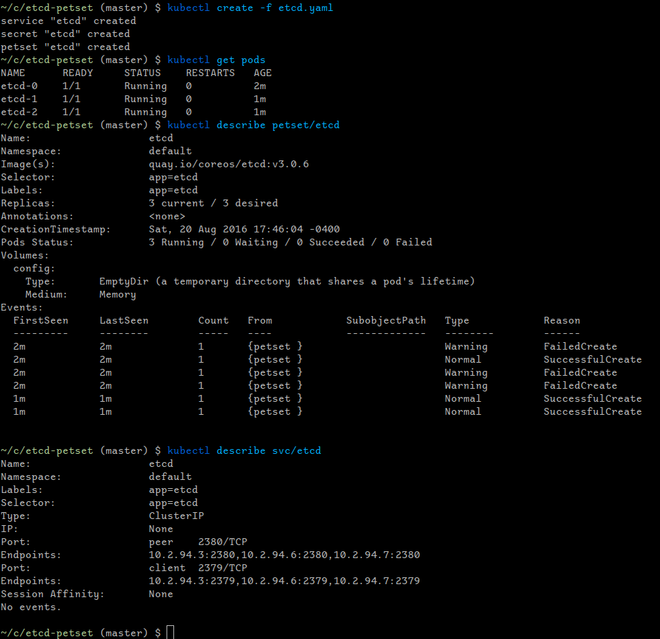

Example Kubernetes `PetSet` manifest for an `etcd` `PetSet`.

`PetSet`s are still very early types in Kubernetes, but we can get `etcd` up and
running with one, with a few particulars.

Of note:
  - We must use the full DNS path for the peer URL, because the peer URL must
    - be resolvable before the associated `Service` discovers this Pod (chicken-and-egg problem)
    - be resolvable externally
    - match the advertised name with the initial cluster
    - this _probably_ isn't necessary if you use the Discovery URL method.
  - We can't assign a clusterIP to the `Service` because if we do, the `PetSet`
    unit names (e.g. etcd-0.etcd.default.svc.cluster.local) do not get created,
    though the service does.
  - We can't create a _separate_ service for clients with a clusterIP because
    something apparently gets confused or crossed, and the `PetSet` unit names
    don't get defined, either.

